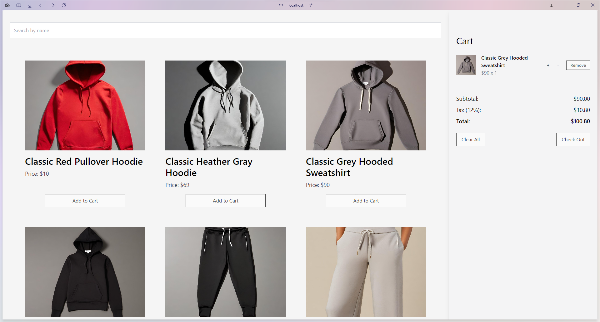
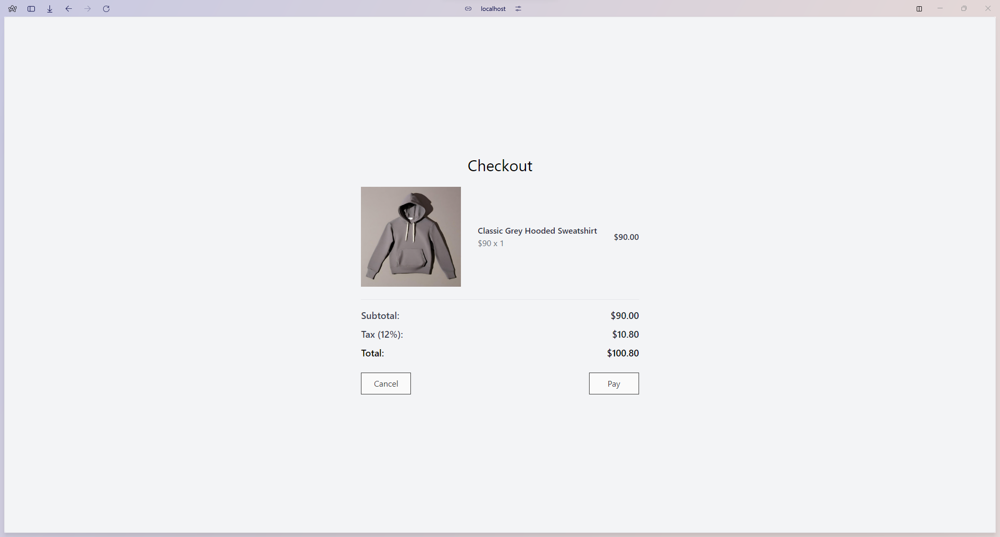

# Shopping Cart

A simple shopping cart application built with React, allowing users to browse products, add them to a cart, and proceed to checkout.

---

## How to Run the Project

1. **Clone the repository:**
   ```bash
   git clone https://github.com/maeEsp/shopping-cart.git
   ```

2. **Navigate to the project folder:**
   ```bash
   cd shopping-cart
   ```

3. **Install dependencies:**
   ```bash
   npm install
   ```

4. **Run the project locally:**
   ```bash
   npm start
   ```

   The app will be running at `http://localhost:3000/`.

---

## Libraries Used


```
├── react
│   ├── react-dom
│   └── react-router-dom
├── tailwindcss
│   ├── postcss
│   └── autoprefixer
├── prop-types
├── usehooks-ts
└── vite

```

---

## Image of the Shopping Cart

### Home Page


### Checkout Page


